<div align="center">



<br><br>



<br><br>

<a href="https://github.com/mehranyahya/project-genesis"></a>
<a href="https://lovable.dev/projects/be793b77-d478-4a00-b423-7d282bd08424"></a>

<br>

<sub><strong>PROJECT GENESIS</strong> · MEHRARA / MHR-001 · editorial open-source edition</sub>

</div>

---

## The project

**Project Genesis** is the engineering system behind Mehrara's bilingual, order-driven digital experience for natural stone, memorial work, architectural stone and bespoke Stoneworks.

It is intentionally **not** a payment-first storefront. Visitors explore materials, work and services, then move into a structured request and consultation workflow.

> **Design direction:** Quiet Architectural Intelligence — light-first, material-led, restrained, and built around the visual language of natural stone.

## Architecture

| Layer | Stack |
| --- | --- |
| Frontend + SSR | TanStack Start · React 19 · Vite |
| Runtime + deployment | Cloudflare Workers |
| Data + storage | Supabase |
| Edge | Supabase Edge Functions · Deno |
| Content | Git-managed pages + build-time structured artifacts |
| Package manager | Bun 1.3.14 |
| Languages | Persian RTL `/` · English LTR `/en` |

### Core surfaces

`Home` · `Memorial Stones` · `Building Stone` · `Stoneworks` · `Portfolio` · `Guides` · `Quote` · `About` · `Contact` · `Privacy` · `Terms`

## Content architecture

Git-managed pages live under `content/pages/` and are generated with:

```sh
bun run content:generate
```

Operational Supabase data and media are read at build time and converted into cleaned public artifacts:

```sh
bun run structured:generate
```

Release validation also checks the reviewed Privacy/Terms content, terms registry and structured artifacts. Missing real content must resolve to an empty state or `CONTENT_BLOCKED`; fabricated fixtures are not promoted into release output.

## Local development

The Bun version is pinned in `package.json`.

```sh
git clone https://github.com/mehranyahya/project-genesis.git
cd project-genesis
bun install --frozen-lockfile
bun run dev
```

Useful verification commands:

```sh
bun run lint
bun test
bun run edge:check
bun run content:check
bun run build
```

## Security and deployment discipline

Secrets are documented by name in `.env.example` and must live only in the destination secret store. Real credentials must never be committed to Git, pull requests, logs, issues or release artifacts.

Preview and production use separate GitHub Actions secrets/variables. A noindex technical preview may use `PREVIEW_TECHNICAL` before final content exists; `CONTENT_FINALIZED` and the release-content check remain mandatory for production. Production DNS and public release stay explicitly gated, while preview indexing is controlled through `PUBLIC_INDEXING`.

Operational Supabase migrations are coupled to encrypted backups, checksum validation and restore drills. See [`ops/supabase-backup-restore.md`](ops/supabase-backup-restore.md).

## Open-source direction

Project Genesis is being developed as a real production-oriented system while its public repository is used to document the architecture, engineering decisions and reusable implementation patterns behind the project.

The repository is intentionally transparent about its boundaries: operational credentials, private data and production-only configuration stay outside source control.

## Lovable boundary

Lovable is used for UI iteration and synchronization. Backend logic, migrations, workflows, real content, security controls and deployment remain explicitly outside its scope.

[Open the Lovable project →](https://lovable.dev/projects/be793b77-d478-4a00-b423-7d282bd08424)

## Project contract

The current engineering contract, operational rules and repository instructions live in [`AGENTS.md`](AGENTS.md).

## Design note

The visual structure of this README is a **Mehrara-specific editorial adaptation inspired by the Paper Signal direction from [Pretty GitHub](https://github.com/Jenesyx/pretty-github)**. The artwork in `assets/` was created specifically for Project Genesis rather than copying the template's personal identity assets.

---

<div align="center">

**MEHRARA / PROJECT GENESIS**

Natural stone · Architecture · Digital craft

</div>
